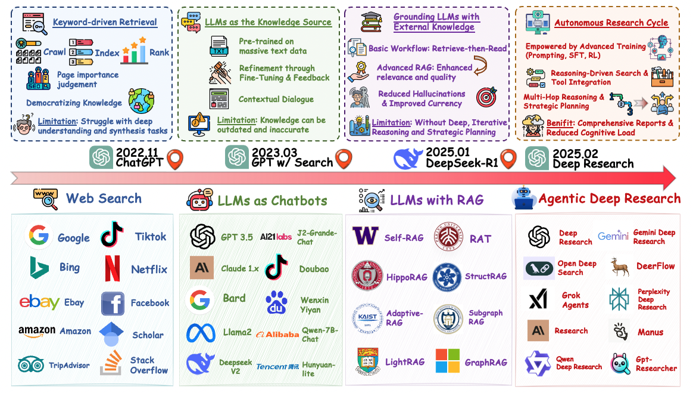
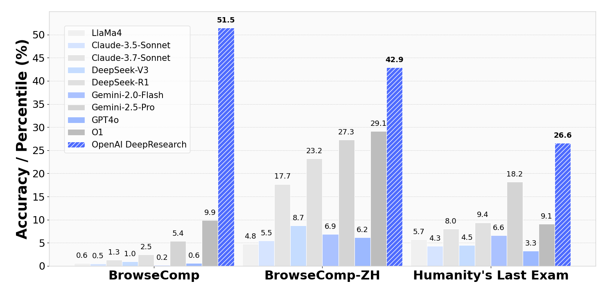

# 🤖 Awesome Agentic Deep Research Resources

 

    

Welcome to Awesome-Deep-Research! 🚀 This repository serves as your comprehensive guide to the cutting-edge world of Agentic Deep Research. We've meticulously curated a collection of resources for you.

  

Whether you're a researcher, developer, or enthusiast, this repository is your gateway to exploring the fascinating intersection of artificial intelligence and autonomous agents.

## Table of Contents
- [🏢 Industry-leading products and solutions](#industry-leading-products)
- [🔧 Open-source implementations and tools](#open-source-implementations)
- [📚 Latest research papers and breakthroughs](#latest-research-papers)
- [🎯 Evaluation benchmarks and practical applications](#benchmarks-and-applications)

## Industry-Leading Products
-  [Gemini Deep Research](https://gemini.google/overview/deep-research/?hl=en): Google's advanced research assistant for deep analysis (December 11, 2024)
-  [Deep Research](https://openai.com/index/introducing-deep-research/): OpenAI's deep research platform for multi-step research tasks (February 2, 2025)
-  [Perplexity Deep Research](https://www.perplexity.ai/hub/blog/introducing-perplexity-deep-research): Perplexity's product for in-depth research and analysis (February 14, 2025)
-  [Grok Agents](https://x.ai/news/grok-3): xAI's autonomous DeepSearch agents powered by Grok-3 (February 19, 2025)
-  [Research](https://www.anthropic.com/news/research): Anthropic's research platform to find and reason with information (April 15, 2025)
-  [Manus](https://manus.im/): Advanced research and analysis platform (March 6, 2025)
- 🦌 [DeerFlow](https://deerflow.tech/): ByteDance's research and analysis solution (May 9, 2025)
-  [Deep Research](https://chat.qwen.ai/?inputFeature=deep_research): Alibaba's Qwen-powered research assistant (May 14, 2025)
-  [Kimi-Researcher](https://moonshotai.github.io/Kimi-Researcher/): Moonshot's research assistant powered by Kimi (June 20, 2025)

## Open-Source Implementations
- [gemini-fullstack-langgraph-quickstart](https://github.com/google-gemini/gemini-fullstack-langgraph-quickstart): Gemini fullstack and LangGraph integration. 
- [multi-agent research system](https://github.com/anthropics/anthropic-cookbook/tree/main/patterns/agents/prompts): Multi-agent research system by Anthropic. [Blog post](https://www.anthropic.com/engineering/built-multi-agent-research-system) 
- [gpt-researcher](https://github.com/assafelovic/gpt-researcher): Autonomous agent for comprehensive research tasks. 
- [DeerFlow](https://github.com/bytedance/deer-flow): ByteDance's open-source deep research framework. 
- [r1-reasoning-rag](https://github.com/deansaco/r1-reasoning-rag): Reasoning-augmented retrieval-augmented generation framework. 
- [nanoDeepResearch](https://github.com/liyuan24/nanoDeepResearch): Lightweight deep research toolkit. 
- [deep-research (Aomni)](https://github.com/dzhng/deep-research): Deep research assistant by Aomni. 
- [deep-research (u14app)](https://github.com/u14app/deep-research): Deep research platform by u14app. 
- [open-deep-research](https://github.com/btahir/open-deep-research): Open-source deep research framework. 
- [deep-searcher](https://github.com/zilliztech/deep-searcher): Deep search and research toolkit. 
- [node-DeepResearch](https://github.com/jina-ai/node-DeepResearch): Deep research toolkit to find the right answers. 
- [Auto-Deep-Research](https://github.com/HKUDS/Auto-Deep-Research): Automated deep research agent. 
- [langgraph-deep-research](https://github.com/foreveryh/langgraph-deep-research): Deep research workflows with LangGraph. 
- [DeepResearchAgent](https://github.com/SkyworkAI/DeepResearchAgent): Deep research agent by SkyworkAI. 
- [OpenManus](https://github.com/FoundationAgents/OpenManus): An open-source framework for building general AI agents. 

## Latest Research Papers

🔥🔥🔥 This section showcases the most recent and impactful research papers in the field of Agentic Deep Research. Each paper represents a significant advancement in the development of autonomous research agents, search capabilities, and reasoning frameworks. The papers are organized chronologically, with the most recent publications at the top. Key areas covered include:
- 🤖 Agentic frameworks for deep research
- 🔍 Search-enhanced reasoning models
- 🌐 Web agents for deep research
- 🔄 Reasoning and retrieval-augmented generation
- 📊 Multimodal deep research

🚀🚀🚀 Stay tuned for the hottest breakthroughs in the field!

| Title | Date & Code | Base LLM model | Optimization & Implementation |
| --- | :---: | :---: | :---: |
| [Search-o1: Agentic Search-Enhanced Large Reasoning Models](https://arxiv.org/pdf/2501.05366) | [2025/01/09](https://github.com/sunnynexus/Search-o1)  | Qwen | Prompting |
| [Agentic Reasoning: Reasoning LLMs with Tools for the Deep Research](https://arxiv.org/abs/2502.04644) | [2025/02/07](https://github.com/theworldofagents/Agentic-Reasoning)  | N/A | Prompting |
| [Open Deep Search: Democratizing Search with Open-source Reasoning Agents](https://arxiv.org/pdf/2503.20201) | [2025/03/26](https://github.com/sentient-agi/OpenDeepSearch)  | Deepseek, Llama | Prompting |
| [Demystifying and Enhancing the Efficiency of Large Language Model Based Search Agents](https://arxiv.org/pdf/2505.12065) | [2025/05/17](https://github.com/tiannuo-yang/SearchAgent-X)  | Qwen | Prompting |
| [Multimodal DeepResearcher: Generating Text-Chart Interleaved Reports From Scratch with Agentic Framework](https://arxiv.org/abs/2506.02454) | [2025/06/03]() | Claude | Prompting |
| [R1-Searcher: Incentivizing the Search Capability in LLMs via Reinforcement Learning](https://arxiv.org/pdf/2503.05592) | [2025/03/07](https://github.com/RUCAIBox/R1-Searcher)  | Llama, Qwen | Reinforcement Learning |
| [Search-R1: Training LLMs to Reason and Leverage Search Engines with Reinforcement Learning](https://arxiv.org/pdf/2503.09516) | [2025/03/12](https://github.com/PeterGriffinJin/Search-R1)  | Llama, Qwen | Reinforcement Learning |
| [ReSearch: Learning to Reason with Search for LLMs via Reinforcement Learning](https://arxiv.org/pdf/2503.19470) | [2025/03/25](https://github.com/Agent-RL/ReSearch)  | Qwen | Reinforcement Learning |
| [DeepResearcher: Scaling Deep Research via Reinforcement Learning in Real-world Environments](https://arxiv.org/pdf/2504.03160?) | [2025/03/26](https://github.com/GAIR-NLP/DeepResearcher)  | Qwen | Reinforcement Learning |
| [Reinforced Internal-External Knowledge Synergistic Reasoning for Efficient Adaptive Search Agent](https://arxiv.org/abs/2505.07596) | [2025/05/12](https://github.com/hzy312/knowledge-r1)  | Qwen | Reinforcement Learning |
| [Pangu Ultra: Pushing the Limits of Dense Large Language Models on Ascend NPUs](https://arxiv.org/abs/2504.07866) | [2025/04/11](https://github.com/pangu-tech/pangu-ultra)  | Pangu | Supervised Fine-Tuning, Reinforcement Learning |
| [Webthinker: Empowering large reasoning models with deep research capability](https://arxiv.org/abs/2504.21776) | [2025/04/30](https://github.com/RUC-NLPIR/WebThinker)  | Qwen | Supervised Fine-Tuning, Reinforcement Learning |
| [ZeroSearch: Incentivize the Search Capability of LLMs without Searching](https://arxiv.org/pdf/2505.04588) | [2025/05/07](https://github.com/Alibaba-NLP/ZeroSearch)  | Llama, Qwen | Supervised Fine-Tuning, Reinforcement Learning |
| [s3 - Efficient Yet Effective Search Agent Training via RL](https://arxiv.org/abs/2505.14146) | [2025/05/20](https://github.com/pat-jj/s3)  | Llama, Qwen | Supervised Fine-Tuning, Reinforcement Learning |
| [R1-Searcher++: Incentivizing the Dynamic Knowledge Acquisition of LLMs via Reinforcement Learning](https://arxiv.org/abs/2505.17005) | [2025/05/22](https://github.com/RUCAIBox/R1-Searcher-plus)  | Llama, Qwen | Supervised Fine-Tuning, Reinforcement Learning |
| [Process vs. Outcome Reward: Which is Better for Agentic RAG Reinforcement Learning](https://arxiv.org/abs/2505.14069) | [2025/05/22](https://github.com/wlzhang2020/ReasonRAG)  | Qwen | Supervised Fine-Tuning, Reinforcement Learning |
| [WebAgent-R1: Training Web Agents via End-to-End Multi-Turn Reinforcement Learning](https://arxiv.org/abs/2505.16421) | [2025/05/22](https://github.com/weizhepei/WebAgent-R1)  | Llama, Qwen | Supervised Fine-Tuning, Reinforcement Learning |
| [MaskSearch: A Universal Pre-Training Framework to Enhance Agentic Search Capability](https://arxiv.org/pdf/2505.20285) | [2025/05/27](https://github.com/Alibaba-NLP/MaskSearch)  | Qwen | Supervised Fine-Tuning, Reinforcement Learning |
| [RAG-Gym: Systematic Optimization of Language Agents for Retrieval-Augmented Generation](https://arxiv.org/pdf/2502.13957v2) | [2025/05/31](https://github.com/RAG-Gym/RAG-Gym)  | Llama, Qwen | Supervised Fine-Tuning, Reinforcement Learning |

## Benchmarks and Applications

  

- Humanity's Last Exam [[Paper]](https://arxiv.org/abs/2501.14249) [[Code]](https://github.com/centerforaisafety/hle) 
- BrowseComp: A Simple Yet Challenging Benchmark for Browsing Agents [[Paper]](https://arxiv.org/pdf/2504.12516) [[Code]](https://github.com/openai/simple-evals) 
- BrowseComp-ZH: Benchmarking Web Browsing Ability of Large Language Models in Chinese ['[Paper]'](https://arxiv.org/pdf/2504.19314) [[Code]](https://github.com/PALIN2018/BrowseComp-ZH) 
- DeepResearch Bench: A Comprehensive Benchmark for Deep Research Agents [[Paper]](https://arxiv.org/pdf/2506.11763) [[Code]](https://github.com/Ayanami0730/deep_research_bench) 
- MedBrowseComp: Benchmarking Medical Deep Research and Computer Use [[Paper]](https://arxiv.org/pdf/2505.14963) [[Code]](https://github.com/shan23chen/MedBrowseComp) 
