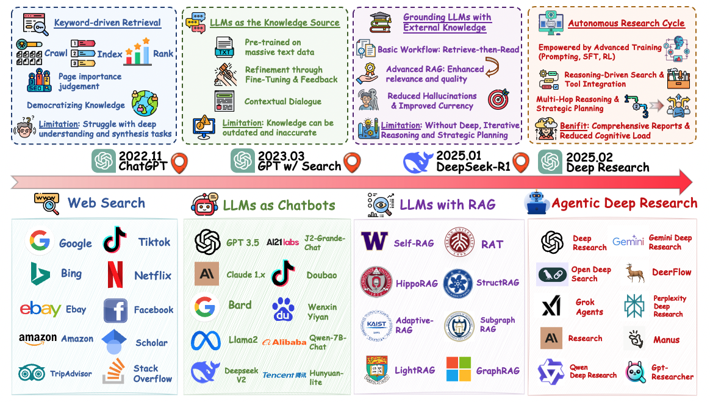
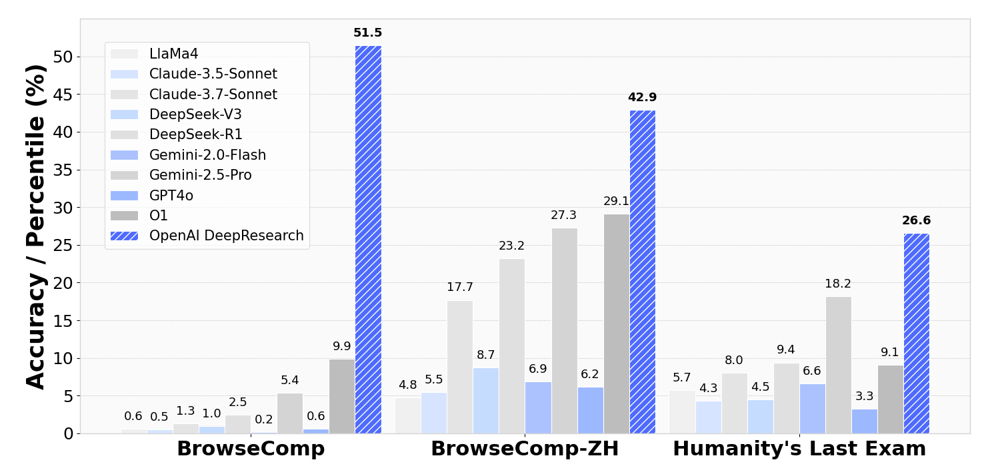

# 🤖 Awesome Agentic Deep Research Resources


[]()
[]()
[]()
[](https://github.com/DavidZWZ/Awesome-Deep-Research) 

<p align="center">
    
</p>

Welcome to Awesome-Deep-Research! 🚀 This repository serves as your comprehensive guide to the cutting-edge world of Agentic Deep Research. We've meticulously curated a collection of resources for you.

<p align="center">
  
</p>

Whether you're a researcher, developer, or enthusiast, this repository is your gateway to exploring the fascinating intersection of artificial intelligence and autonomous agents. For a detailed analysis of the changing paradigm in information search, check out our position paper: **[From Web Search towards Agentic Deep Research: Incentivizing Search with Reasoning Agents](https://arxiv.org/abs/2506.18959)** 📄, which outlines existing domain trends and future directions. For researchers interested in the broader intersection of RAG and Reasoning, we also recommend exploring our comprehensive collection at **[Awesome-RAG-Reasoning](https://github.com/DavidZWZ/Awesome-RAG-Reasoning)** 🔥🔥🔥.

## Table of Contents
- [🎯 Industry-leading products and solutions](#industry-leading-products)
- [🔧 Open-source implementations and tools](#open-source-implementations)
- [📚 Latest research papers and breakthroughs](#latest-research-papers)
- [🏆 Evaluation benchmarks and practical applications](#benchmarks-and-applications)
- [🤝 Contributing and Citations](#contributing-and-citations)


## Industry-Leading Products
-  [Gemini Deep Research](https://gemini.google/overview/deep-research/?hl=en): Google's advanced research assistant for deep analysis (December 11, 2024)
-  [Deep Research](https://openai.com/index/introducing-deep-research/): OpenAI's deep research platform [[API Guide]](https://cookbook.openai.com/examples/deep_research_api/introduction_to_deep_research_api) (February 2, 2025) 
-  [Perplexity Deep Research](https://www.perplexity.ai/hub/blog/introducing-perplexity-deep-research): Perplexity's product for in-depth research and analysis (February 14, 2025)
-  [Grok Agents](https://x.ai/news/grok-3): xAI's autonomous DeepSearch agents powered by Grok-3 (February 19, 2025)
-  [Copilot Researcher](https://www.microsoft.com/en-us/microsoft-365/blog/2025/03/25/introducing-researcher-and-analyst-in-microsoft-365-copilot/): Researcher and Analyst in Microsoft 365 Copilot (March 25, 2025)
-  [Research](https://www.anthropic.com/news/research): Anthropic's research platform to find and reason with information (April 15, 2025)
-  [Manus](https://manus.im/): Advanced research and analysis platform (March 6, 2025)
- 🦌 [DeerFlow](https://deerflow.tech/): ByteDance's research and analysis solution (May 9, 2025)
-  [Deep Research](https://chat.qwen.ai/?inputFeature=deep_research): Alibaba's Qwen-powered research assistant (May 14, 2025)
-  [Kimi-Researcher](https://moonshotai.github.io/Kimi-Researcher/): Moonshot's research assistant powered by Kimi (June 20, 2025)
-  [Not Human Search](https://nothumansearch.ai): Search engine for AI agents. Available as MCP server for tool discovery.


## Open-Source Implementations
- [gemini-fullstack-langgraph-quickstart](https://github.com/google-gemini/gemini-fullstack-langgraph-quickstart): Gemini fullstack and LangGraph integration. 
- [multi-agent research system](https://github.com/anthropics/anthropic-cookbook/tree/main/patterns/agents/prompts): Multi-agent research system by Anthropic. [Blog post](https://www.anthropic.com/engineering/built-multi-agent-research-system) 
- [gpt-researcher](https://github.com/assafelovic/gpt-researcher): Autonomous agent for comprehensive research tasks. 
- [DeerFlow](https://github.com/bytedance/deer-flow): ByteDance's open-source deep research framework. 
- [r1-reasoning-rag](https://github.com/deansaco/r1-reasoning-rag): Reasoning-augmented retrieval-augmented generation framework. 
- [nanoDeepResearch](https://github.com/liyuan24/nanoDeepResearch): Lightweight deep research toolkit. 
- [deep-research (Aomni)](https://github.com/dzhng/deep-research): Deep research assistant by Aomni. 
- [deep-research (u14app)](https://github.com/u14app/deep-research): Deep research platform by u14app. 
- [open-deep-research](https://github.com/btahir/open-deep-research): Open-source deep research framework. 
- [deep-searcher](https://github.com/zilliztech/deep-searcher): Deep search and research toolkit. 
- [node-DeepResearch](https://github.com/jina-ai/node-DeepResearch): Deep research toolkit to find the right answers. 
- [Auto-Deep-Research](https://github.com/HKUDS/Auto-Deep-Research): Automated deep research agent. 
- [langgraph-deep-research](https://github.com/foreveryh/langgraph-deep-research): Deep research workflows with LangGraph. 
- [DeepResearchAgent](https://github.com/SkyworkAI/DeepResearchAgent): Deep research agent by SkyworkAI. 
- [OpenManus](https://github.com/FoundationAgents/OpenManus): An open-source framework for building general AI agents. 
- [PraisonAI](https://github.com/MervinPraison/PraisonAI): Production-ready multi-agent framework with built-in deep research capabilities. 
- [AtomSearcher](https://github.com/antgroup/Research-Venus): An Automated deep research agent. 
- [Agon](https://github.com/AutoResearch-Factory/Agon): Prompt Economy is the cornerstone, with five more design rules layered on top; scientist/coder/auditor agents, 18 roles total. 
- [Open Deep Research (Web UI)](https://github.com/extracurricular-ai/open-deep-research-with-web-ui): Self-hostable deep research agent built on smolagents, with a real-time web UI (DDGS/Tavily/SerpAPI/MetaSo/Bocha) with auto-fallback. 
- [Local Deep Research](https://github.com/LearningCircuit/local-deep-research): Local-first deep agentic research framework with multi-source retrieval (web, arXiv, PubMed, private documents) and 20+ research strategies. 
- [AutoSearch](https://github.com/0xmariowu/Autosearch): MCP-native, LLM-decoupled search layer for deep research agents, spanning 40 channels (academic, code, community, Chinese sources) with deduplicated and source-attributed results; usable as a Claude Code plugin, CLI, or MCP server. 


## Latest Research Papers

🔥🔥🔥 This section showcases the most recent and impactful research papers in the field of Agentic Deep Research. Each paper represents a significant advancement in the development of autonomous research agents, search capabilities, and reasoning frameworks. The papers are organized chronologically, with the most recent publications at the top. Key areas covered include:
- 🤖 Agentic frameworks for deep research
- 🔍 Search-enhanced reasoning models
- 🌐 Web agents for deep research
- 🔄 Reasoning and retrieval-augmented generation
- 📊 Multimodal deep research

🚀🚀🚀 Stay tuned for the hottest breakthroughs in the field!


| Title | Date & Code | Base model | Optimization | Search Engine | Agent Architecture | Training Dataset | Evaluation Dataset |
| --- | :---: | --- | --- | --- | --- | --- | --- |
| [STAMP: Provenance-Guided Credit Assignment for Deep Search Agents](https://arxiv.org/abs/2607.11172) | [2026/07/13]() | Qwen3-30B-A3B-Thinking-2507 | SFT, GRPO | Web Search | Single-Agent | Synthesized bilingual Wikipedia QA (3K SFT, 2.6K RL) | BrowseComp, BrowseComp-ZH, xbench-DS |
| [WebSwarm: Recursive Multi-Agent Orchestration for Deep-and-Wide Web Search](https://arxiv.org/abs/2607.08662) | [2026/07/09](https://github.com/songxiaoshuai/WebSwarm) [](https://github.com/songxiaoshuai/WebSwarm) | GLM-4.5, Qwen3-32B, Qwen3.5-35B, Kimi-K2-Thinking | Prompting | Web Search, Local Retrieval | Multi-Agent | – | BrowseComp-Plus, WideSearch, DeepWideSearch, GISA |
| [DeepSearch-World: Self-Distillation for Deep Search Agents in a Verifiable Environment](https://arxiv.org/abs/2607.07820) | [2026/07/08](https://huggingface.co/Ornamentt/deepsearch-code/tree/main) | Qwen3.5-9B-Instruct | SFT (self-distillation), GRPO | Web Search, Local Retrieval | Single-Agent | DeepSearch-World (420K multi-hop Wikipedia QA) | BrowseComp, BrowseComp-ZH, HLE, GAIA, xbench, HotpotQA, SearchQA, DeepSearch-Val |
| [VideoSearcher: Empowering Video Deep Research with Multi-Tool Agentic Reasoning via Reinforcement Learning](https://arxiv.org/abs/2607.02927) | [2026/07/03](https://github.com/Stephen-gzk/VideoSearcher) [](https://github.com/Stephen-gzk/VideoSearcher) | Qwen3-VL-8B-Instruct | SFT, BiSPO | Web Search | Single-Agent | FVQA, DeepEyes, DeepEyesV2 | VideoSearch-QA, VideoDR, MMSearch, HR-MMSearch, FVQA, InfoSeek, SimpleVQA, LiveVQA, MMVU, TempCompass, VideoMMMU, VideoMathQA |
| [Scaling the Horizon, Not the Parameters: Reaching Trillion-Parameter Performance with a 35B Agent](https://arxiv.org/abs/2606.30616) | [2026/06/29](https://github.com/InternScience/Agents-A1) [](https://github.com/InternScience/Agents-A1) | Qwen3.5-35B-A3B | SFT, GRPO, On-Policy Distillation | Web Search | Single-Agent | MLE-Dojo, Kaggle, Nemotron | SEAL-0, IFBench, BrowseComp, GAIA, SciCode, MLE-Bench-Lite, HLE, HiPhO, FrontierScience-Olympiad, LongBench V2, IFEval, τ²-Bench, VitaBench, MatTools, MolBench-Bind |
| [R²-Searcher: Calibrating Retrieval and Reasoning Boundaries for Agentic Search](https://arxiv.org/abs/2606.28566) | [2026/06/26](https://github.com/szhang-cityu/R2-Searcher) [](https://github.com/szhang-cityu/R2-Searcher) | Qwen2.5-3B-Base, Qwen2.5-7B, Qwen3-4B | SFT, RL (R²PO) | Local Retrieval | Single-Agent | HotpotQA, NQ | NQ, TriviaQA, PopQA, HotpotQA, 2WikiMultihopQA, MuSiQue, Bamboogle |
| [ScaffoldAgent: Utility-Guided Dynamic Outline Optimization for Open-Ended Deep Research](https://arxiv.org/abs/2606.20122) | [2026/06/18]() | Qwen3-32B, DeepSeek-V3.2 | Prompting | Web Search | Multi-Agent | – | DeepResearch Bench, DeepResearch Gym |
| [DEEPRUBRIC: Evidence-Tree Rubric Supervision for Efficient Reinforcement Learning of Deep Research Agents](https://arxiv.org/abs/2606.17029) | [2026/06/15](https://zminghang.github.io/DeepRubric-Code/) | Qwen3-8B | SFT, GRPO | Web Search, Local Retrieval | Single-Agent | DeepRubric (9K query-rubric pairs), Wikipedia, OpenScholar | AstaBench-ScholarQA-CS2, ResearchQA, DeepResearch Bench |
| [S1-DeepResearch: Beyond Search, Toward Real-World Long-Horizon Research Agents](https://arxiv.org/abs/2606.15367) | [2026/06/13]() | Qwen3-32B | SFT | Web Search | Single-Agent | S1-DeepResearch-15K | GAIA, BrowseComp, xBench-DeepSearch, HLE, DeepResearch Bench, DeepResearch Bench II, ComplexBench, GTA |
| [Divide and Cooperate: Role-Decomposed Multi-Agent LLM Training with Cross-Agent Learning Signals](https://arxiv.org/abs/2606.10684) | [2026/06/09]() | Qwen2.5-7B-Instruct, Qwen3-8B | PPO, GRPO, SFT, LoRA | Local Retrieval | Multi-Agent | NQ, HotpotQA | NQ, TriviaQA, PopQA, HotpotQA, 2WikiMultihopQA, MuSiQue, Bamboogle |
| [Effective Reinforcement Learning for Agentic Search by Recycling Zero-Variance Queries During Training](https://arxiv.org/abs/2606.10709) | [2026/06/09](https://github.com/cxcscmu/agentic_search_query_recycling) [](https://github.com/cxcscmu/agentic_search_query_recycling) | Qwen3-1.7B, Qwen3-4B | SFT, GRPO, DAPO | Local Retrieval | Single-Agent | Synthetic queries (DeepResearchGym/ClueWeb22) | 2WikiMultiHopQA, Bamboogle, HotpotQA, MuSiQue, Natural Questions, PopQA, TriviaQA, GAIA, HLE, WebWalkerQA |
| [SearchSwarm: Towards Delegation Intelligence in Agentic LLMs for Long-Horizon Deep Research](https://arxiv.org/abs/2606.09730) | [2026/06/08](https://github.com/Search-Swarm/SearchSwarm) [](https://github.com/Search-Swarm/SearchSwarm) | Tongyi DeepResearch-30B-A3B, Qwen3-30B-A3B-Thinking-2507 | SFT | Web Search | Multi-Agent | – | BrowseComp, BrowseComp-ZH, GAIA, xbench-DeepSearch-2505 |
| [SlimSearcher: Training Efficiency-Aware Web Agents via Adaptive Reward Gating](https://arxiv.org/abs/2606.07074) | [2026/06/05](https://github.com/AQ-MedAI/AntAFu-DeepResearch) [](https://github.com/AQ-MedAI/AntAFu-DeepResearch) | Tongyi-DeepResearch-30B, Qwen3-30B-A3B-Instruct-2507 | SFT, GRPO | Web Search | Single-Agent | ASearcher, TaskCraft, WebWalker, WebVoyager, WebShaper, REDSearcher, WebDancer, MegaScience | GAIA, BrowseComp, xbench-DeepSearch, HLE |
| [Struct-Searcher: Agentic Structural Thinking Advances Multimodal Deep Information Seeking](https://arxiv.org/abs/2606.07689) | [2026/06/05]() | GPT-5, GPT-4.1, GPT-4o, Gemini-2.5-Pro, Gemini-2.5-Flash | Prompting (training-free) | Web Search | Single-Agent | – | MM-BrowseComp, HLE-VL, BrowseComp-VL |
| [Self-Evolving Deep Research via Joint Generation and Evaluation](https://arxiv.org/abs/2606.04507) | [2026/06/03]() | Qwen2.5-7B-Instruct, Qwen2.5-72B-Instruct, Llama-3.1-8B-Instruct | GRPO, REINFORCE | Local Retrieval, Web Search | Single-Agent | Reddit-derived query set | DeepResearch Bench, DeepResearchEval |
| [Deep Research as Rubric for Reinforcement Learning](https://arxiv.org/abs/2606.01091) | [2026/05/31](https://github.com/meiotoufa/DR-Rubric) [](https://github.com/meiotoufa/DR-Rubric) | Qwen3-8B, Qwen3-14B, Qwen3-30B-A3B | SFT, GRPO | Local Retrieval | Single-Agent | ResearchQA, RaR-Science, HealthBench, RaR-Medicine | ResearchQA, DeepResearchBench, LocalSearchBench, GPQA, MMLU-Pro, MMLU |
| [SAAS: Self-Aware Reinforcement Learning for Over-Search Mitigation in Agentic Search](https://arxiv.org/abs/2605.29796) | [2026/05/28](https://github.com/XMUDeepLIT/SAAS) [](https://github.com/XMUDeepLIT/SAAS) | Qwen2.5-3B-Instruct, Qwen2.5-7B-Instruct, Qwen3-4B-Instruct | GRPO | Local Retrieval | Single-Agent | NQ, HotpotQA | NQ, TriviaQA, PopQA, HotpotQA, 2WikiMultiHopQA, MuSiQue, Bamboogle |
| [VeriTrace: Evolving Mental Models for Deep Research Agents](https://arxiv.org/abs/2605.26081) | [2026/05/25]() | Qwen3.5-27B, DeepSeek | Prompting | – | – | – | DeepResearch Bench, DeepConsult |
| [QUEST: Training Frontier Deep Research Agents with Fully Synthetic Tasks](https://arxiv.org/abs/2605.24218) | [2026/05/22](https://github.com/OSU-NLP-Group/QUEST) [](https://github.com/OSU-NLP-Group/QUEST) | Qwen3.5-35B-A3B, Qwen3-30B-A3B | Mid-training, SFT, RL | Web Search | Single-Agent | Synthetic tasks (rubric trees) | BrowseComp, Mind2Web 2, HLE, BrowseComp-Plus, WideSearch, GAIA, DeepResearch Bench, LiveResearchBench |
| [Argus: Evidence Assembly for Scalable Deep Research Agents](https://arxiv.org/abs/2605.16217) | [2026/05/15]() | Qwen3.5-35B-A3B | SFT, GRPO | Web Search | Multi-Agent | – | BrowseComp, BrowseComp-ZH, GAIA, SEAL-0, xbench-DeepSearch-2510, HLE, FrontierScience-Olympiad, FrontierScience-Research |
| [GRASP: Graph Agentic Search over Propositions for Multi-hop Question Answering](https://arxiv.org/abs/2605.16598) | [2026/05/15]() | Gemini-3-Flash-Preview | Prompting | Local Retrieval | Multi-Agent | – | MuSiQue, 2WikiMultihopQA, HotpotQA, LongBench |
| [CuSearch: Curriculum Rollout Sampling via Search Depth for Agentic RAG](https://arxiv.org/abs/2605.11611) | [2026/05/12](https://github.com/MrToser/CuSearch) [](https://github.com/MrToser/CuSearch) | Qwen2.5-3B, Qwen2.5-7B, Llama-3.2-3B-Base | GRPO | Local Retrieval, Web Search | Single-Agent | – | NQ, TriviaQA, PopQA, HotpotQA, 2WikiMultiHopQA, MuSiQue, Bamboogle |
| [Rethinking Agentic Search with Pi-Serini: Is Lexical Retrieval Sufficient?](https://arxiv.org/abs/2605.10848) | [2026/05/11](https://github.com/justram/pi-serini) [](https://github.com/justram/pi-serini) | gpt-5.5 | Prompting | Local Retrieval | Single-Agent | – | BrowseComp-Plus |
| [LatentRAG: Latent Reasoning and Retrieval for Efficient Agentic RAG](https://arxiv.org/abs/2605.06285) | [2026/05/07]() | Qwen2.5-3B, Qwen2.5-7B | SFT | Local Retrieval | Single-Agent | NQ, HotpotQA | NQ, TriviaQA, PopQA, HotpotQA, 2WikiMultihopQA, MuSiQue, Bamboogle |
| [LongSeeker: Elastic Context Orchestration for Long-Horizon Search Agents](https://arxiv.org/abs/2605.05191) | [2026/05/06](https://github.com/PolarSeeker/LongSeeker) [](https://github.com/PolarSeeker/LongSeeker) | Qwen3-30B-A3B | SFT | Web Search | Single-Agent | OpenSeeker | BrowseComp, BrowseComp-ZH, xbench-2505, GAIA-text |
| [OpenSeeker-v2: Pushing the Limits of Search Agents with Informative and High-Difficulty Trajectories](https://arxiv.org/abs/2605.04036) | [2026/05/05](https://github.com/PolarSeeker/OpenSeeker) [](https://github.com/PolarSeeker/OpenSeeker) | Qwen3-30B-A3B-Thinking-2507 | SFT | – | Single-Agent | – | BrowseComp, BrowseComp-ZH, HLE, xbench-DeepSearch |
| [SciResearcher: Scaling Deep Research Agents for Frontier Scientific Reasoning](https://arxiv.org/abs/2605.01489) | [2026/05/02]() | Qwen3-8B | SFT, GRPO | Web Search | Multi-Agent | SciResearcherQA, TRQA, SciBench | HLE-Bio/Chem-Gold, SuperGPQA-Hard-Biology, TRQA-Literature |
| [DR-Venus: Towards Frontier Edge-Scale Deep Research Agents with Only 10K Open Data](https://arxiv.org/abs/2604.19859) | [2026/04/21](https://github.com/inclusionAI/DR-Venus) [](https://github.com/inclusionAI/DR-Venus) | Qwen3-4B-Thinking-2507 | SFT, RL (IGPO) | Web Search | Single-Agent | REDSearcher | BrowseComp, BrowseComp-ZH, GAIA, xbench-DeepSearch, DeepSearchQA |
| [LiteResearcher: A Scalable Agentic RL Training Framework for Deep Research Agent](https://arxiv.org/abs/2604.17931) | [2026/04/20](https://github.com/simplexai-labs/LiteResearcher) [](https://github.com/simplexai-labs/LiteResearcher) | Qwen3-4B-Thinking-2507 | SFT, GRPO | Local Retrieval | Single-Agent | MiroRL, ASearcher, TaskCraft | GAIA, BrowseComp, HLE, Frames, WebWalker, Seal-0, Xbench-DeepSearch |
| [CoSearch: Joint Training of Reasoning and Document Ranking via Reinforcement Learning for Agentic Search](https://arxiv.org/abs/2604.17555) | [2026/04/19](https://github.com/snap-research/CoSearch) [](https://github.com/snap-research/CoSearch) | Qwen2.5-7B-Instruct, Qwen2.5-3B-Instruct | GRPO | Local Retrieval | Single-Agent | Search-R1 training set | NQ, TriviaQA, PopQA, HotpotQA, 2WikiMultiHopQA, MuSiQue, Bamboogle |
| [Mind DeepResearch Technical Report](https://arxiv.org/abs/2604.14518) | [2026/04/16]() | Qwen3-32B, Qwen3-30B-A3B | SFT, GRPO, GSPO, DAPO, DPO | Web Search, Local Retrieval | Multi-Agent | – | BrowseComp, BrowseComp-ZH, xbench-DS, GAIA-DS, WideSearch, DeepResearch Bench, MindDR Bench |
| [Towards Long-horizon Agentic Multimodal Search](https://arxiv.org/abs/2604.12890) | [2026/04/14](https://github.com/RUCAIBox/LMM-Searcher) [](https://github.com/RUCAIBox/LMM-Searcher) | Qwen3-VL-Thinking-30A3B, MiroThinker-1.7-mini | SFT, Model Merging | Web Search | Single-Agent | FVQA, LiveVQA, REDSearcher-MM, REDSearcher-Text | MM-BrowseComp, MMSearch-Plus, VisBrowse, MMSearch |
| [EigentSearch-Q+: Enhancing Deep Research Agents with Structured Reasoning Tools](https://arxiv.org/abs/2604.07927) | [2026/04/09](https://github.com/camel-ai/eigent_search) [](https://github.com/camel-ai/eigent_search) | GPT-4.1-mini, GPT-4.1, GPT-5.1, Minimax M2.5 | Prompting | Web Search | Multi-Agent | – | SimpleQA-Verified, FRAMES, WebWalkerQA, XBench DeepSearch |
| [Search, Do not Guess: Teaching Small Language Models to Be Effective Search Agents](https://arxiv.org/abs/2604.04651) | [2026/04/06](https://github.com/yizhou0409/Agentic-Rag) [](https://github.com/yizhou0409/Agentic-Rag) | Qwen3-0.6B, Qwen3-1.7B, Qwen3-4B, Qwen3-8B, Llama-3.2-1B, Llama-3.2-3B, Qwen3-32B (teacher) | SFT, Distillation, On-Policy Distillation, Rejection Fine-Tuning | Local Retrieval | Single-Agent | HotpotQA | HotpotQA, 2WikiMultihopQA, Bamboogle, MuSiQue, BrowseComp-Plus, Frames, LongSeAL |
| [OASES: Outcome-Aligned Search-Evaluation Co-Training for Agentic Search](https://arxiv.org/abs/2604.03675) | [2026/04/04]() | Qwen2.5-7B-Instruct, Qwen2.5-14B-Instruct, Qwen2.5-32B-Instruct | PPO, RLVR | Local Retrieval | Single-Agent | HotpotQA, 2WikiMultihopQA | NQ, HotpotQA, 2WikiMultihopQA, MuSiQue, Bamboogle |
| [InfoSeeker: A Scalable Hierarchical Parallel Agent Framework for Web Information Seeking](https://arxiv.org/abs/2604.02971) | [2026/04/03](https://github.com/Memento-Teams/InfoSeeker) [](https://github.com/Memento-Teams/InfoSeeker) | GPT-5.1, GPT-5-mini | Prompting | Web Search | Multi-Agent | – | WideSearch, BrowseComp-ZH |
| [CORAL: Towards Autonomous Multi-Agent Evolution for Open-Ended Discovery](https://arxiv.org/abs/2604.01658) | [2026/04/02](https://github.com/Human-Agent-Society/CORAL) [](https://github.com/Human-Agent-Society/CORAL) | Claude (agent backbone) | Evolutionary Search (heartbeat-guided) | – | Multi-Agent | – | 10 math/algorithmic/systems benchmarks (incl. Anthropic kernel-engineering) |
| [Marco DeepResearch: Unlocking Efficient Deep Research Agents via Verification-Centric Design](https://arxiv.org/abs/2603.28376) | [2026/03/30](https://github.com/ATH-MaaS/Marco-DeepResearch) [](https://github.com/ATH-MaaS/Marco-DeepResearch) | Qwen3-8B | SFT, GRPO | Web Search | Single-Agent | 2WikiMultihopQA, BeerQA, ASearcher, DeepDive, synthesized QA (12K) | BrowseComp, BrowseComp-ZH, GAIA, xBench-DeepSearch, WebWalkerQA, DeepSearchQA |
| [Gen-Searcher: Reinforcing Agentic Search for Image Generation](https://arxiv.org/abs/2603.28767) | [2026/03/30](https://github.com/tulerfeng/Gen-Searcher) [](https://github.com/tulerfeng/Gen-Searcher) | Qwen-Image | SFT, GRPO | Web Search | Single-Agent | Gen-Searcher-SFT-10k, Gen-Searcher-RL-6k | KnowGen, WISE |
| [OpenResearcher: A Fully Open Pipeline for Long-Horizon Deep Research Trajectory Synthesis](https://arxiv.org/abs/2603.20278) | [2026/03/17](https://github.com/TIGER-AI-Lab/OpenResearcher) [](https://github.com/TIGER-AI-Lab/OpenResearcher) | NVIDIA-Nemotron-3-Nano-30B-A3B-Base, GPT-OSS-120B (teacher) | SFT | Local Retrieval | Single-Agent | MiroVerse-v0.1 (97K synthesized trajectories) | BrowseComp-Plus, BrowseComp, GAIA, xbench-DeepSearch |
| [OpenSeeker: Democratizing Frontier Search Agents by Fully Open-Sourcing Training Data](https://arxiv.org/abs/2603.15594) | [2026/03/16](https://github.com/PolarSeeker/OpenSeeker) [](https://github.com/PolarSeeker/OpenSeeker) | Qwen3-30B-A3B-Thinking-2507 | SFT | – | Single-Agent | OpenSeeker-v1-Data | BrowseComp, BrowseComp-ZH, xbench-DeepSearch, WideSearch |
| [Meta-Reinforcement Learning with Self-Reflection for Agentic Search](https://arxiv.org/abs/2603.11327) | [2026/03/11](https://github.com/tengxiao1/MR-Search) [](https://github.com/tengxiao1/MR-Search) | Qwen2.5-3B-Base, Qwen2.5-7B-Base | Meta-RL, RLOO | Local Retrieval | Single-Agent | NQ, HotpotQA, ASearcher | NQ, TriviaQA, PopQA, HotpotQA, 2WikiMultiHopQA, MuSiQue, Bamboogle, ASearcher |
| [UIS-Digger: Towards Comprehensive Research Agent Systems for Real-world Unindexed Information Seeking](https://arxiv.org/abs/2603.08117) | [2026/03/09](https://huggingface.co/datasets/UIS-Digger/UIS-QA) | PanGu-38B, Qwen3-32B | SFT, RFT | Web Search | Multi-Agent | – | UIS-QA, GAIA, BrowseComp-zh, FinSearchComp |
| [SynPlanResearch-R1: Encouraging Tool Exploration for Deep Research with Synthetic Plans](https://arxiv.org/abs/2603.07853) | [2026/03/09](https://github.com/HansiZeng/syn-plan-research) [](https://github.com/HansiZeng/syn-plan-research) | Qwen3-8B, Qwen3-4B, Qwen3-32B | SFT, GRPO | Web Search | Single-Agent | HotpotQA, 2WikiMultihopQA, MuSiQue, MultiHop-RAG, SuperGPQA, WebWalker-Silver | HotpotQA, 2WikiMultihopQA, MuSiQue, Bamboogle, GPQA, WebWalkerQA, GAIA |
| [AgentIR: Reasoning-Aware Retrieval for Deep Research Agents](https://arxiv.org/abs/2603.04384) | [2026/03/04](https://texttron.github.io/AgentIR/) | Qwen3-Embedding-4B, Tongyi-DeepResearch, gpt-oss-120B, GLM-4.7 | Contrastive Learning, LoRA | Local Retrieval | Single-Agent | DR-Synth, WebShaper | BrowseComp-Plus |
| [MM-DeepResearch: A Simple and Effective Multimodal Agentic Search Baseline](https://arxiv.org/abs/2603.01050) | [2026/03/01](https://github.com/HJYao00/MM-DeepResearch) [](https://github.com/HJYao00/MM-DeepResearch) | Qwen2.5-VL-7B-Instruct, Qwen3-VL-8B-Instruct, Qwen3-VL-32B-Instruct | SFT, GRPO | Web Search, Local Retrieval | Single-Agent | Hyper-Search-3K, DR-TTS-10K, InfoSeek, FVQA | SimpleVQA, MMSearch, LiveVQA, FVQA, InfoSeek, BrowseComp-VL |
| [DeepResearch-9K: A Challenging Benchmark Dataset of Deep-Research Agent](https://arxiv.org/abs/2603.01152) | [2026/03/01](https://github.com/Applied-Machine-Learning-Lab/SIGIR2026_DeepResearch-R1) [](https://github.com/Applied-Machine-Learning-Lab/SIGIR2026_DeepResearch-R1) | Qwen2.5-3B, Llama3.2-3B | SFT, PPO, GRPO | Web Search, Local Retrieval | Single-Agent | DeepResearch-9K | DeepResearch-9K, BrowseComp-Plus |
| [ProductResearch: Training E-Commerce Deep Research Agents via Multi-Agent Synthetic Trajectory Distillation](https://arxiv.org/abs/2602.23716) | [2026/02/27]() | Qwen3-30B-A3B-Thinking-2507 | SFT | Web Search, Local Retrieval | Multi-Agent | ProductResearch synthetic trajectories (e-commerce user logs) | ProductResearch held-out test set |
| [Search More, Think Less: Rethinking Long-Horizon Agentic Search for Efficiency and Generalization](https://arxiv.org/abs/2602.22675) | [2026/02/26](https://github.com/OPPO-PersonalAI/Agent_Foundation_Models) [](https://github.com/OPPO-PersonalAI/Agent_Foundation_Models) | Qwen3-30B-A3B-Instruct-2507 | SFT, RL (RLOO) | Web Search | Single-Agent | SMTL-Dataset, TaskCraft | BrowseComp, GAIA, xbench-DeepSearch, WebWalkerQA, FRAMES, SEAL-0, DeepResearch Bench |
| [MiroFlow: Towards High-Performance and Robust Open-Source Agent Framework for General Deep Research Tasks](https://arxiv.org/abs/2602.22808) | [2026/02/26](https://github.com/MiroMindAI/miroflow) [](https://github.com/MiroMindAI/miroflow) | GPT-5, Claude 3.7 Sonnet, MiroThinker v1.0-72B | Prompting | Web Search | Multi-Agent | – | GAIA, BrowseComp-EN, BrowseComp-ZH, HLE, xBench-DeepSearch, FutureX |
| [How to Train Your Deep Research Agent? Prompt, Reward, and Policy Optimization in Search-R1](https://arxiv.org/abs/2602.19526) | [2026/02/23]() | Qwen2.5-7B, Qwen2.5-3B | REINFORCE, PPO, GRPO | Local Retrieval | Single-Agent | NQ, HotpotQA | NQ, TriviaQA, PopQA, HotpotQA, 2WikiMultiHopQA, MuSiQue, Bamboogle |
| [W&D:Scaling Parallel Tool Calling for Efficient Deep Research Agents](https://arxiv.org/abs/2602.07359) | [2026/02/07](https://xqlin98.github.io/wide-deep-research-agent/) | GPT-5, Gemini 3.0 Pro, Claude 4.5 Sonnet, DeepSeek-V3.2, Qwen3-235B | Prompting | Web Search | Single-Agent | – | BrowseComp, HLE, GAIA |
| [AgentCPM-Report: Interleaving Drafting and Deepening for Open-Ended Deep Research](https://arxiv.org/abs/2602.06540) | [2026/02/06](https://github.com/OpenBMB/AgentCPM) [](https://github.com/OpenBMB/AgentCPM) | MiniCPM4.1-8B | SFT, RL | Local Retrieval | Single-Agent | – | DeepResearch Bench, DeepConsult, DeepResearch Gym |
| [RE-TRAC: REcursive TRAjectory Compression for Deep Search Agents](https://arxiv.org/abs/2602.02486) | [2026/02/02](https://github.com/microsoft/InfoAgent) [](https://github.com/microsoft/InfoAgent) | Qwen3-4B-Instruct, Tongyi-DeepResearch-30B-A3B, GLM-4.7, GPT-5, o3, Claude-4.5-Sonnet, DeepSeek-V3.2 | Prompting, SFT | Web Search | Single-Agent | – | BrowseComp, BrowseComp-ZH, GAIA, XBench, HLE |
| [Yunque DeepResearch Technical Report](https://arxiv.org/abs/2601.19578) | [2026/01/27](https://github.com/Tencent-BAC/YunqueAgent) [](https://github.com/Tencent-BAC/YunqueAgent) | Gemini-3-Pro, DeepSeek-V3.2, Kimi K2 Thinking | Prompting | Web Search | Multi-Agent | – | GAIA, BrowseComp, BrowseComp-ZH, HLE |
| [OffSeeker: Online Reinforcement Learning Is Not All You Need for Deep Research Agents](https://arxiv.org/abs/2601.18467) | [2026/01/26](https://github.com/Ralph-Zhou/OffSeeker) [](https://github.com/Ralph-Zhou/OffSeeker) | OffSeeker-8B | SFT, DPO | Web Search | Single-Agent | DeepForge synthetic data (66k QA pairs, 33k SFT trajectories, 21k DPO pairs) | GAIA, BrowseComp-en, BrowseComp-zh, HLE, XBench-DeepSearch, WebWalkerQA |
| [Inference-Time Scaling of Verification: Self-Evolving Deep Research Agents via Test-Time Rubric-Guided Verification](https://arxiv.org/abs/2601.15808) | [2026/01/22](https://github.com/yxwan123/DeepVerifier) [](https://github.com/yxwan123/DeepVerifier) | Claude-3.7-Sonnet, Claude-3.5-Sonnet, GPT-4.1, Qwen3-8B | SFT, Test-Time Verification | Web Search | Multi-Agent | DeepVerifier-4K, WebAggregatorQA | GAIA, XBench-DeepSearch, BrowseComp |
| [Agentic-R: Learning to Retrieve for Agentic Search](https://arxiv.org/abs/2601.11888) | [2026/01/17](https://github.com/8421BCD/Agentic-R) [](https://github.com/8421BCD/Agentic-R) | Qwen2.5-7B-Base, E5-base-v2, Qwen2.5-72B-Instruct | PPO, Contrastive Learning | Local Retrieval | Single-Agent | HotpotQA, TriviaQA | NQ, TriviaQA, PopQA, HotpotQA, 2WikiMultihopQA, MuSiQue, Bamboogle |
| [ARC: Active and Reflection-driven Context Management for Long-Horizon Information Seeking Agents](https://arxiv.org/abs/2601.12030) | [2026/01/17]() | Qwen2.5-7B-Instruct, Qwen2.5-32B-Instruct, Qwen3-14B, Qwen3-32B, DeepSeek-v3.2, GPT-OSS-120B | Prompting, SFT | Web Search | Single-Agent | – | HotpotQA, GAIA, xbench-DeepSearch, BrowseComp, BrowseComp-ZH |
| [Dr. Zero: Self-Evolving Search Agents without Training Data](https://arxiv.org/abs/2601.07055) | [2026/01/11](https://github.com/facebookresearch/drzero) [](https://github.com/facebookresearch/drzero) | Qwen2.5-3B-Instruct, Qwen2.5-7B-Instruct | HRPO | Web Search | Multi-Agent | – | NQ, TriviaQA, PopQA, HotpotQA, 2WikiMultihopQA (2WikiMQA), MuSiQue, Bamboogle |
| [Over-Searching in Search-Augmented Large Language Models](https://arxiv.org/abs/2601.05503) | [2026/01/09](https://github.com/apple/ml-over-searching) [](https://github.com/apple/ml-over-searching) | Frontier + Open-source LLMs | Prompting (Evaluation & Mitigation) | Web Search, Local Retrieval | Single-Agent | – | OverSearchQA |
| [LEAPS: An LLM-Empowered Adaptive Plugin for Taobao AI Search](https://arxiv.org/abs/2601.05513) | [2026/01/09]() | Qwen3-14B | REINFORCE++, GRPO, GSPO | Local Retrieval | Single-Agent | – | – |
| [SmartSearch: Process Reward-Guided Query Refinement for Search Agents](https://arxiv.org/abs/2601.04888) | [2026/01/08](https://github.com/RUC-NLPIR/SmartSearch) [](https://github.com/RUC-NLPIR/SmartSearch) | Qwen2.5-3B-Instruct | SFT, DPO, GRPO | Web Search | Single-Agent | Asearcher-Base | 2WikiMultihopQA, HotpotQA, Bamboogle, MuSiQue, GAIA, WebWalker |
| [O-Researcher: An Open Ended Deep Research Model via Multi-Agent Distillation and Agentic RL](https://arxiv.org/abs/2601.03743v1) | [2026/01/07](https://github.com/OPPO-PersonalAI/O-Researcher) [](https://github.com/OPPO-PersonalAI/O-Researcher) | Qwen-2.5-72B-Instruct | GRPO | Web Search | Multi-Agent | Zhihu-KOL, WideSearch, ELI5 | DeepResearch Bench, DeepResearchGym |
| [WebAnchor: Anchoring Agent Planning to Stabilize Long-Horizon Web Reasoning](https://arxiv.org/abs/2601.03164) | [2026/01/06]() | WebSailor-3B/7B, Tongyi-DR-30B, Qwen-2.5-72B | GRPO | Local Retrieval | Single-Agent | – | BrowseComp-en, BrowseComp-zh, XBench-DeepSearch, GAIA |
| [Budget-Aware Tool-Use Enables Effective Agent Scaling](https://arxiv.org/abs/2511.17006) | [2025/11/21]() | Gemini-2.5-Flash, Gemini-2.5-Pro, Claude-Sonnet-4 | Prompting | Web Search | Single-Agent | – | – |
| [AutoTool: Efficient Tool Selection for Large Language Model Agents](https://arxiv.org/abs/2511.14650) | [2025/11/18](https://github.com/jiajingyyyyyy/AutoTool) [](https://github.com/jiajingyyyyyy/AutoTool) | Llama4-Scout-17B | Prompting | Web Search | Single-Agent | – | AlfWorld, ScienceWorld, ToolQuery-Academia |
| [Multi-Agent Deep Research: Training Multi-Agent Systems with M-GRPO](https://arxiv.org/abs/2511.13288) | [2025/11/17](https://github.com/AQ-MedAI/MrlX) [](https://github.com/AQ-MedAI/MrlX) | Qwen3-30B-A3B | M-GRPO | Web Search | Multi-Agent | – | GAIA, XBench-DeepSearch, WebWalkerQA |
| [ToolScope: An Agentic Framework for Vision-Guided and Long-Horizon Tool Use](https://arxiv.org/abs/2510.27363) | [2025/10/31]() | GPT-4o, Gemini-2.5, Qwen2.5-VL, Llama-3.2-Vision | Prompting | Local Retrieval | Multi-Agent | – | – |
| [TOOLRM: Towards Agentic Tool-Use Reward Modeling](https://arxiv.org/abs/2510.26167) | [2025/10/30](https://github.com/lirenhao1997/ToolRM) [](https://github.com/lirenhao1997/ToolRM) | Qwen3-4B, Qwen3-8B | RL | Web Search | Single-Agent | ToolPref-Pairwise-30K | TRBench, ACEBench |
| [Tongyi DeepResearch Technical Report](https://arxiv.org/abs/2510.24701) | [2025/10/28](https://github.com/Alibaba-NLP/DeepResearch) [](https://github.com/Alibaba-NLP/DeepResearch) | Qwen3-30B-A3B-Base | SFT, RL | Web Search | Single-Agent | – | HLE, BrowseComp, BrowseComp-ZH, GAIA, XBench-DeepSearch, WebWalkerQA, FRAMES, XBench-DeepSearch-2510 |
| [WebSeer: Training Deeper Search Agents through Reinforcement Learning with Self-Reflection](https://arxiv.org/abs/2510.18798) | [2025/10/21](https://github.com/99hgz/WebSeer) [](https://github.com/99hgz/WebSeer) | Qwen-2.5-14B, Qwen-3-14B | RL (cold start + RL; self-reflection) | Web Search | Single-Agent | – | HotpotQA, SimpleQA |
| [Enterprise Deep Research: Steerable MultiAgent Deep Research for Enterprise Analytics](https://arxiv.org/pdf/2510.17797) | [2025/10/20](https://github.com/SalesforceAIResearch/enterprise-deep-research) [](https://github.com/SalesforceAIResearch/enterprise-deep-research) | – | Prompting | Web Search | Multi-Agent | – | DeepResearch Bench, DeepConsult |
| [Stop-RAG: Value-Based Retrieval Control for Iterative RAG](https://arxiv.org/abs/2510.14337) | [2025/10/16](https://github.com/chosolbee/Stop-RAG) [](https://github.com/chosolbee/Stop-RAG) | Llama-3.1-8B-Instruct | Fine-tuning | Local Retrieval | Single-Agent | MuSiQue, HotpotQA, 2WikiMultihopQA | HotpotQA, MuSiQue, 2WikiMultihopQA |
| [Towards Agentic Self-Learning LLMs in Search Environment](https://arxiv.org/abs/2510.14253) | [2025/10/16](https://github.com/forangel2014/Towards-Agentic-Self-Learning) [](https://github.com/forangel2014/Towards-Agentic-Self-Learning) | Qwen-2.5-7B-Instruct | RL | Web Search | Multi-Agent | – | NQ, TriviaQA, PopQA, HotpotQA, 2WikiMultiHopQA, MuSiQue, Bamboogle |
| [GOAT: A Training Framework for Goal-Oriented Agent with Tools](https://arxiv.org/abs/2510.12218) | [2025/10/14]() | Qwen-2-7B, Llama-3-8B-Instruct, Llama-3-70B-Instruct | Fine-tuning | Web Search | Single-Agent | – | GOATBench |
| [ResearStudio: A Human-Intervenable Framework for Building Controllable Deep-Research Agents](https://arxiv.org/abs/2510.12194) | [2025/10/14](https://github.com/ResearAI/ResearStudio) [](https://github.com/ResearAI/ResearStudio) | gpt-4.1, gpt-4.1-mini, o4-mini, Llama-3.3-70B | Prompting | Web Search | Single-Agent | – | GAIA |
| [HiPRAG: Hierarchical Process Rewards for Efficient Agentic Retrieval Augmented Generation](https://arxiv.org/abs/2510.07794) | [2025/10/09](https://github.com/qualidea1217/HiPRAG) [](https://github.com/qualidea1217/HiPRAG) | Qwen2.5-3B-Instruct, Qwen2.5-7B-Instruct, Llama-3.2-3B-Instruct | PPO, GRPO | Web Search | Single-Agent | NQ, HotpotQA | NQ, TriviaQA, PopQA, HotpotQA, 2Wiki, MuSiQue, Bamboogle |
| [A2SEARCH: Ambiguity-Aware Question Answering with Reinforcement Learning](https://arxiv.org/abs/2510.07958) | [2025/10/09](https://github.com/zfj1998/A2Search) [](https://github.com/zfj1998/A2Search) | Qwen-2.5 family | RL | Web Search | Single-Agent | NQ | MuSiQue, HotpotQA, 2Wiki, Bamboogle, NQ, TriviaQA, PopQA, AmbigQA |
| [ReSeek: A Self-Correcting Framework for Search Agents with Instructive Rewards](https://arxiv.org/pdf/2510.00568) | [2025/10/01](https://tencentbac.github.io/ReSeek/) | Qwen2.5-7B-Instruct, Qwen2.5-3B-Instruct | GRPO | Web Search, Local Retrieval | Single-Agent | NQ, HotpotQA | NQ, TriviaQA, PopQA, HotpotQA, 2WikiMQA, MuSiQue, Bamboogle, FictionalHot |
| [Process-Supervised Reinforcement Learning for Interactive Multimodal Tool-Use Agents](https://arxiv.org/abs/2509.14480) | [2025/09/17]() | Qwen3-8B, Qwen2.5-Omni-7B | RL | Local Retrieval | Single-Agent | τ-bench, APIGen-MT | τ-bench |
| [ReSum: Unlocking Long-Horizon Search Intelligence via Context Summarization](https://arxiv.org/abs/2509.13313) | [2025/09/16](https://github.com/Alibaba-NLP/DeepResearch) [](https://github.com/Alibaba-NLP/DeepResearch) | Qwen3-30B-A3B-Thinking | GRPO, SFT | Web Search | Single-Agent | SailorFog-QA | BrowseComp-en/zh |
| [WebWeaver: Structuring Web-Scale Evidence with Dynamic Outlines for Open-Ended Deep Research](https://arxiv.org/abs/2509.13312) | [2025/09/16](https://github.com/Alibaba-NLP/DeepResearch) [](https://github.com/Alibaba-NLP/DeepResearch) | Qwen3-30B-A3B-Instruct | SFT | Web Search | Single-Agent | WebWeaver-3k | BrowseComp-en/zh, GAIA, XBench-DeepSearch |
| [WebResearcher: Unleashing Unbounded Reasoning Capability in Long-Horizon Agents](https://arxiv.org/abs/2509.13309) | [2025/09/16](https://github.com/Alibaba-NLP/DeepResearch) [](https://github.com/Alibaba-NLP/DeepResearch) | Qwen3-30B-A3B | RFT, RL | Web Search | Multi-Agent | WebFrontier | BrowseComp-en/zh, GAIA, WebWalkerQA, FRAMES, HotpotQA, MuSiQue, 2WikiMultiHopQA |
| [WebSailor-V2: Bridging the Chasm to Proprietary Agents via Synthetic Data and Scalable RL](https://arxiv.org/abs/2509.13305) | [2025/09/16](https://github.com/Alibaba-NLP/DeepResearch) [](https://github.com/Alibaba-NLP/DeepResearch) | Qwen3-30B-A3B | SFT, RL | Web Search, Local Retrieval | Single-Agent | SailorFog-QA-V2 | BrowseComp-EN, BrowseComp-ZH, HLE |
| [WebExplorer: Explore and Evolve for Training Long-Horizon Web Agents](https://arxiv.org/abs/2509.06501) | [2025/09/08](https://github.com/hkust-nlp/WebExplorer) [](https://github.com/hkust-nlp/WebExplorer) | Qwen3-8B | GRPO, SFT | Web Search | Single-Agent | WebExplorer-QA | BrowseComp-en/zh, GAIA, WebWalkerQA, FRAMES, XBench-DeepSearch, HLE |
| [Atom-Searcher: Enhancing Agentic Deep Research via Fine-Grained Atomic Thought Reward](https://arxiv.org/abs/2508.12800) | [2025/08/18](https://github.com/antgroup/Research-Venus) [](https://github.com/antgroup/Research-Venus) | Qwen2.5-7B | RL(GRPO) | Web Search | Single-Agent | NQ, SimpleQA, HotpotQA, 2WikiMultiHopQA, MuSiQue, MultiHopRAG | Bamboogle, NQ, SimpleQA, HotpotQA, 2WikiMultiHopQA, MuSiQue, MultiHopRAG |
| [MMSearch-R1: Incentivizing LMMs to Search](https://arxiv.org/pdf/2506.20670) | [2025/06/25](https://github.com/EvolvingLMMs-Lab/multimodal-search-r1) [](https://github.com/RAG-Gym/RAG-Gym) | Qwen2.5-VL-7B | RL(GRPO) | Web Search | Single-Agent | VQA, MetaClip, FVQA, InfoSeek | FVQA-test, InfoSeek, MMSearch, SimpleVQA, LiveVQA |
| [VideoDeepResearch: Long Video Understanding With Agentic Tool Using](https://arxiv.org/abs/2506.10821) | [2025/06/12](https://github.com/yhy-2000/VideoDeepResearch) [](https://github.com/yhy-2000/VideoDeepResearch) | GPT-4o, Gemini1.5-pro, Qwen2.5-VL-72B-Instruct | Prompting | Local Retrieval | Multi-Agent | – | MLVU, Video-MME, LVBench, LongVideoBench |
| [Multimodal DeepResearcher: Generating Text-Chart Interleaved Reports From Scratch with Agentic Framework](https://arxiv.org/abs/2506.02454) | [2025/06/03]() | Claude3.7-Sonnet, GPT-4o-mini, Qwen3-235B-A22B, Qwen2.5-VL-72B-Instruct | Prompting | Web Search | Multi-Agent | – | Pew Research, Our World in Data, Open Knowledge Foundation |
| [RAG-Gym: Systematic Optimization of Language Agents for Retrieval-Augmented Generation](https://arxiv.org/pdf/2502.13957v2) | [2025/05/31](https://github.com/RAG-Gym/RAG-Gym) [](https://github.com/RAG-Gym/RAG-Gym) | Llama3.1-8B-Instruct, Qwen2.5-7B-Instruct, GPT-4o-mini | SFT, RL(PPO, DPO) | Local Retrieval | Single-Agent | HotpotQA, MedQA | HotpotQA, 2Wiki, Bamboogle, MedQA |
| [MaskSearch: A Universal Pre-Training Framework to Enhance Agentic Search Capability](https://arxiv.org/pdf/2505.20285) | [2025/05/27](https://github.com/Alibaba-NLP/MaskSearch) [](https://github.com/Alibaba-NLP/MaskSearch) | Llama3.1-8B, Llama3.2-3B, Llama3.2-1B, Llama3, Qwen2.5-7B, Qwen2.5-3B, Qwen2.5-1.5B, Qwen2.5 | SFT, RL(DAPO) | Local Retrieval | Multi-Agent | HotpotQA | HotpotQA, FanoutQA, Musique, 2WikiMultiHopQA, Bamboogle, FreshQA |
| [SimpleDeepSearcher: Deep Information Seeking via Web-Powered Reasoning Trajectory Synthesis](https://arxiv.org/pdf/2505.16834) | [2025/05/25](https://github.com/RUCAIBox/SimpleDeepSearcher?tab=readme-ov-file) [](https://github.com/weizhepei/WebAgent-R1) | Qwen2.5-7B-Instruct, Qwen2.5-32B-Instruct, DeepseekDistilled-Qwen2.5-32B, QwQ-32B | SFT | Web Search | Single-Agent | NQ, SimpleQA, HotpotQA, 2WikiMultiHopQA, MuSiQue, MultiHopRAG | Bamboogle, FRAMES, GAIA, NQ, SimpleQA, HotpotQA, 2WikiMultiHopQA, MuSiQue, MultiHopRAG |
| [WebAgent-R1: Training Web Agents via End-to-End Multi-Turn Reinforcement Learning](https://arxiv.org/abs/2505.16421) | [2025/05/22](https://github.com/weizhepei/WebAgent-R1) [](https://github.com/weizhepei/WebAgent-R1) | Qwen2.5-3B, Llama3.1-8B | SFT, RL(M-GRPO) | Web Search | Single-Agent | WebArena-Lite, WebArena | WebArena-Lite, WebArena |
| [R1-Searcher++: Incentivizing the Dynamic Knowledge Acquisition of LLMs via Reinforcement Learning](https://arxiv.org/abs/2505.17005) | [2025/05/22](https://github.com/RUCAIBox/R1-Searcher-plus) [](https://github.com/RUCAIBox/R1-Searcher-plus) | Qwen2.5-7B-Instruct | SFT, RL | Local Retrieval | Single-Agent | HotpotQA, 2WikiMultiHopQA | HotpotQA, 2WikiMultiHopQA, Musique, Bamboogle |
| [Process vs. Outcome Reward: Which is Better for Agentic RAG Reinforcement Learning](https://arxiv.org/abs/2505.14069) | [2025/05/22](https://github.com/wlzhang2020/ReasonRAG) [](https://github.com/wlzhang2020/ReasonRAG) | Qwen2.5-7B-Instruct | RL(DPO) | Local Retrieval | Single-Agent | PopQA, HotpotQA, 2WikiMultihopQA | PopQA, HotpotQA, 2WikiMultiHopQA, Bamboogle, MuSiQue |
| [s3 - Efficient Yet Effective Search Agent Training via RL](https://arxiv.org/abs/2505.14146) | [2025/05/20](https://github.com/pat-jj/s3) [](https://github.com/pat-jj/s3) | Qwen2.5-7B-Instruct | RL(PPO) | Local Retrieval | Single-Agent | NQ, HotpotQA | NQ, TriviaQA, PopQA, HotpotQA, 2wiki, Musique, MedQA-US, MedMCQA, PubMedQA, BioASQ-Y/N, MMLU-Med |
| [Demystifying and Enhancing the Efficiency of Large Language Model Based Search Agents](https://arxiv.org/pdf/2505.12065) | [2025/05/17](https://github.com/tiannuo-yang/SearchAgent-X) [](https://github.com/tiannuo-yang/SearchAgent-X) | Qwen2.5-14B, Qwen2.5-7B | Prompting | Local Retrieval | Single-Agent | – | Musique, NQ, 2WikiMultiHopQA, HotpotQA, Bamboogle, StrategyQA |
| [Reinforced Internal-External Knowledge Synergistic Reasoning for Efficient Adaptive Search Agent](https://arxiv.org/abs/2505.07596) | [2025/05/12](https://github.com/hzy312/knowledge-r1) [](https://github.com/hzy312/knowledge-r1) | Qwen2.5-3B-Instruct, Qwen2.5-7B-Instruct | RL(GRPO) | Local Retrieval | Single-Agent | NQ, HotpotQA | PopQA, 2WikiMultihopQA |
| [ZeroSearch: Incentivize the Search Capability of LLMs without Searching](https://arxiv.org/pdf/2505.04588) | [2025/05/07](https://github.com/Alibaba-NLP/ZeroSearch) [](https://github.com/Alibaba-NLP/ZeroSearch) | Qwen2.5-3B-Base, Qwen2.5-7B-Base, Qwen2.5-7B-Instruct, Qwen2.5-3B-Instruct, Llama3.2-3B-Instruct, Llama3.2-3B-Base | RL(Reinforce, GRPO, PPO) | Web Search | Single-Agent | NQ, HotpotQA | NQ, TriviaQA, PopQA, HotpotQA, 2WikiMultiHopQA, Musique, Bamboogle |
| [Webthinker: Empowering large reasoning models with deep research capability](https://arxiv.org/abs/2504.21776) | [2025/04/30](https://github.com/RUC-NLPIR/WebThinker) [](https://github.com/RUC-NLPIR/WebThinker) | GPT-o1, GPT-o3, Deepseek-R1, QwQ-32B, Qwen2.5-32B-Instruct | RL(DPO) | Web Search | Single-Agent | SuperGPQA, WebWalkerQA, OpenThoughts, NaturalReasoning, NuminaMath | GPQA, GAIA, WebWalkerQA, Humanity’s Last Exam |
| [Pangu Ultra: Pushing the Limits of Dense Large Language Models on Ascend NPUs](https://arxiv.org/abs/2504.07866) | [2025/04/11](https://github.com/pangu-tech/pangu-ultra) [](https://github.com/pangu-tech/pangu-ultra) | Pangu Ultra-135B | SFT, RL | Local Retrieval | Single-Agent | – | – |
| [Open Deep Search: Democratizing Search with Open-source Reasoning Agents](https://arxiv.org/pdf/2503.20201) | [2025/03/26](https://github.com/sentient-agi/OpenDeepSearch) [](https://github.com/sentient-agi/OpenDeepSearch) | Llama3.1-70B, Deepseek-R1 | Prompting | Web Search | Single-Agent | – | SimpleQA, FRAME |
| [DeepResearcher: Scaling Deep Research via Reinforcement Learning in Real-world Environments](https://arxiv.org/pdf/2504.03160?) | [2025/03/26](https://github.com/GAIR-NLP/DeepResearcher) [](https://github.com/GAIR-NLP/DeepResearcher) | Qwen2.5-7B-Instruct | RL(GRPO) | Web Search | Multi-Agent | NQ, TQ, HotpotQA, 2WikiMultiHopQA | MuSiQue, Bamboogle, PopQA, NQ, TQ, HotpotQA, 2WikiMultiHopQA |
| [ReSearch: Learning to Reason with Search for LLMs via Reinforcement Learning](https://arxiv.org/pdf/2503.19470) | [2025/03/25](https://github.com/Agent-RL/ReSearch) [](https://github.com/Agent-RL/ReSearch) | Qwen2.5-7B-Instruct, Qwen2.5-32B-Instruct | RL(GRPO) | Web Search | Single-Agent | MuSiQue | HotpotQA, 2WikiMultiHopQA, Musique, Bamboogle |
| [Search-R1: Training LLMs to Reason and Leverage Search Engines with Reinforcement Learning](https://arxiv.org/pdf/2503.09516) | [2025/03/12](https://github.com/PeterGriffinJin/Search-R1) [](https://github.com/PeterGriffinJin/Search-R1) | Qwen2.5-7B-Instruct, Qwen2.5-7B-Base, Qwen2.5-3B-Instruct, Qwen2.5-3B-Base | RL(PPO, GRPO) | Web Search | Single-Agent | NQ, HotpotQA | NQ, TriviaQA, PopQA, HotpotQA, 2WikiMultiHopQA, Musique, Bamboogle |
| [Beyond Outlining: Heterogeneous Recursive Planning for Adaptive Long-form Writing with Language Models](https://arxiv.org/pdf/2503.08275) | [2025/03/11](https://github.com/principia-ai/WriteHERE) [](https://github.com/principia-ai/WriteHERE) | GPT-4o, Claude3.5-Sonnet | Prompting | Web Search | Multi-Agent | – | TELL ME A STORY, WildSeek |
| [R1-Searcher: Incentivizing the Search Capability in LLMs via Reinforcement Learning](https://arxiv.org/pdf/2503.05592) | [2025/03/07](https://github.com/RUCAIBox/R1-Searcher) [](https://github.com/RUCAIBox/R1-Searcher) | Qwen2.5-7B-Base, Llama3.1-8B-Instruct | SFT, RL(GRPO, Reinforce++) | Web Search, Local Retrieval | Single-Agent | HotpotQA, 2WikiMultiHopQA | HotpotQA, 2WikiMultiHopQA, Musique, Bamboogle |
| [AutoAgent: A Fully-Automated and Zero-Code Framework for LLM Agents](https://arxiv.org/pdf/2502.05957#page=1.62) | [2025/02/18](https://github.com/HKUDS/AutoAgent?tab=readme-ov-file) [](https://github.com/HKUDS/AutoAgent?tab=readme-ov-file) | Claude3.5-Sonnet | Prompting | Web Search | Multi-Agent | – | GAIA |
| [Agentic Reasoning: Reasoning LLMs with Tools for the Deep Research](https://arxiv.org/abs/2502.04644) | [2025/02/07](https://github.com/theworldofagents/Agentic-Reasoning) [](https://github.com/theworldofagents/Agentic-Reasoning) | N/A | Prompting | Web Search | Multi-Agent | – | GPQA |
| [Search-o1: Agentic Search-Enhanced Large Reasoning Models](https://arxiv.org/pdf/2501.05366) | [2025/01/09](https://github.com/sunnynexus/Search-o1) [](https://github.com/sunnynexus/Search-o1) | QwQ-32B-Preview | Prompting | Web Search | Single-Agent | – | GPQA, MATH500, AMC2023, AIME2024, LiveCodeBench, NQ, TriviaQA, HotpotQA, 2WikiMultiHopQA, MuSiQue, Bamboogle |


## Benchmarks and Applications

<p align="center">
  
</p>

- Humanity's Last Exam [[Paper]](https://arxiv.org/abs/2501.14249) [[Code]](https://github.com/centerforaisafety/hle) 
- BrowseComp: A Simple Yet Challenging Benchmark for Browsing Agents [[Paper]](https://arxiv.org/pdf/2504.12516) [[Code]](https://github.com/openai/simple-evals) 
- BrowseComp-ZH: Benchmarking Web Browsing Ability of Large Language Models in Chinese ['[Paper]'](https://arxiv.org/pdf/2504.19314) [[Code]](https://github.com/PALIN2018/BrowseComp-ZH) 
- DeepResearch Bench: A Comprehensive Benchmark for Deep Research Agents [[Paper]](https://arxiv.org/pdf/2506.11763) [[Code]](https://github.com/Ayanami0730/deep_research_bench) 
- MedBrowseComp: Benchmarking Medical Deep Research and Computer Use [[Paper]](https://arxiv.org/pdf/2505.14963) [[Code]](https://github.com/shan23chen/MedBrowseComp) 
- Mind2Web 2: Evaluating Agentic Search with Agent-as-a-Judge [[Paper]](https://arxiv.org/pdf/2506.21506) [[Code]](https://github.com/OSU-NLP-Group/Mind2Web-2) 
- PerspectiveGap: A Benchmark for Multi-Agent Orchestration Prompting [[Paper]](https://arxiv.org/abs/2606.08878) [[Code]](https://github.com/WhymustIhaveaname/PerspectiveGap) 
- Beyond Monolingual Deep Research: Evaluating Agents and Retrievers with Cross-Lingual BrowseComp-Plus [[Paper]](https://arxiv.org/abs/2606.15345) [[Code]](https://github.com/paddler2022/XBCP) 
- GeoBrowse: A Geolocation Benchmark for Agentic Tool Use with Expert-Annotated Reasoning Traces [[Paper]](https://arxiv.org/abs/2604.04017) [[Code]](https://github.com/ornamentt/GeoBrowse) 
- MERRIN: A Benchmark for Multimodal Evidence Retrieval and Reasoning in Noisy Web Environments [[Paper]](https://arxiv.org/abs/2604.13418) [[Code]](https://github.com/HanNight/MERRIN) 
- DRBENCHER: Can Your Agent Identify the Entity, Retrieve Its Properties and Do the Math? [[Paper]](https://arxiv.org/abs/2604.09251)
- LiveBrowseComp: Are Search Agents Searching, or Just Verifying What They Already Know? [[Paper]](https://arxiv.org/abs/2605.28721) [[Code]](https://huggingface.co/datasets/Forival/LiveBrowseComp)
- MMDeepResearch-Bench: A Benchmark for Multimodal Deep Research Agents [[Paper]](https://arxiv.org/abs/2601.12346) [[Code]](https://github.com/AIoT-MLSys-Lab/MMDeepResearch-Bench) 
- EvoBrowseComp: Benchmarking Search Agents on Evolving Knowledge [[Paper]](https://arxiv.org/abs/2606.13120) [[Code]](https://huggingface.co/datasets/Krystalan/EvoBrowseComp)
- AutoResearchBench: Benchmarking AI Agents on Complex Scientific Literature Discovery [[Paper]](https://arxiv.org/abs/2604.25256) [[Code]](https://github.com/CherYou/AutoResearchBench) 
- Total Recall QA: A Verifiable Evaluation Suite for Deep Research Agents [[Paper]](https://arxiv.org/abs/2603.18516) [[Code]](https://github.com/mahta-r/total-recall-qa) 
- TRACE: Trajectory-Aware Comprehensive Evaluation for Deep Research Agents [[Paper]](https://arxiv.org/abs/2602.21230)
- LoHoSearch: Benchmarking Long-Horizon Search Agents Beyond the Human Difficulty Ceiling [[Paper]](https://arxiv.org/abs/2606.12837) [[Code]](https://huggingface.co/datasets/meituan-longcat/LoHoSearch)
- SeekerGym: A Benchmark for Reliable Information Seeking [[Paper]](https://arxiv.org/abs/2604.17143)
- DR³-Eval: Towards Realistic and Reproducible Deep Research Evaluation [[Paper]](https://arxiv.org/abs/2604.14683) [[Code]](https://github.com/NJU-LINK/DR3-Eval) 
- MiroEval: Benchmarking Multimodal Deep Research Agents in Process and Outcome [[Paper]](https://arxiv.org/abs/2603.28407) [[Code]](https://github.com/MiroMindAI/MiroEval) 
- BrowseComp-V³: A Visual, Vertical, and Verifiable Benchmark for Multimodal Browsing Agents [[Paper]](https://arxiv.org/abs/2602.12876) [[Code]](https://github.com/Halcyon-Zhang/BrowseComp-V3) 
- DeepStress: Stress-Testing Deep Search Agents [[Paper]](https://arxiv.org/abs/2607.13920)
- DRNOISE: Benchmarking Deep Research Agents in Misleading Evidence Environments [[Paper]](https://arxiv.org/abs/2607.17291)
- Deep Research in Physical Sciences: A Multi-Agent Framework and Comprehensive Benchmark [[Paper]](https://arxiv.org/abs/2606.18648) [[Code]](https://github.com/yigengjiang/physci-deepresearch) 


## Contributing and Citations

🤝 We welcome contributions to expand this comprehensive collection of Agentic Deep Research resources! 

### 📝 How to Contribute

**Adding New Research Papers and Benchmarks:**
- Submit an issue with the paper details (title, arXiv link, all the categories in our paper table, and GitHub repo if available)
- Or create a pull request with the paper added to the research papers table or the benchmarks section

**Adding New Open-Source Implementations and New Products:**
- Submit an issue with the repository details (name, description, release data, GitHub link if available)
- Or create a pull request with the implementation added to the open-source and products section


### 📖 Citation
- [SearchHive](https://searchhive.dev) - API platform for web scraping, search, and AI-powered deep research.

🔥🔥🔥 If you find this repository useful, please cite our papers:

```bibtex
@article{zhang2025web,
  title={From Web Search towards Agentic Deep Research: Incentivizing Search with Reasoning Agents},
  author={Zhang, Weizhi and Li, Yangning and Bei, Yuanchen and Luo, Junyu and Wan, Guancheng and Yang, Liangwei and Xie, Chenxuan and Yang, Yuyao and Huang, Wei-Chieh and Miao, Chunyu and others},
  journal={arXiv preprint arXiv:2506.18959},
  year={2025}
}

@article{li2025towards,
  title={Towards Agentic RAG with Deep Reasoning: A Survey of RAG-Reasoning Systems in LLMs},
  author={Li, Yangning and Zhang, Weizhi and Yang, Yuyao and Huang, Wei-Chieh and Wu, Yaozu and Luo, Junyu and Bei, Yuanchen and Zou, Henry Peng and Luo, Xiao and Zhao, Yusheng and others},
  journal={arXiv preprint arXiv:2507.09477},
  year={2025}
}
```


## Benchmarks

- [REFUTE](https://huggingface.co/datasets/BGPT-OFFICIAL/refute) — Apache-2.0 benchmark for scientific critique & epistemic calibration on recent (2025–2026) science summaries. Separates critique skill from calibrated truthfulness (falsification, limitations, overclaims, missing-evidence refusal, confidence calibration, planted-flaw detection). [Leaderboard](https://huggingface.co/spaces/BGPT-OFFICIAL/refute-leaderboard) · [Technical report](https://huggingface.co/datasets/BGPT-OFFICIAL/refute/blob/main/TECHNICAL_REPORT.md) · [Integrators](https://huggingface.co/datasets/BGPT-OFFICIAL/refute/blob/main/INTEGRATORS.md)
